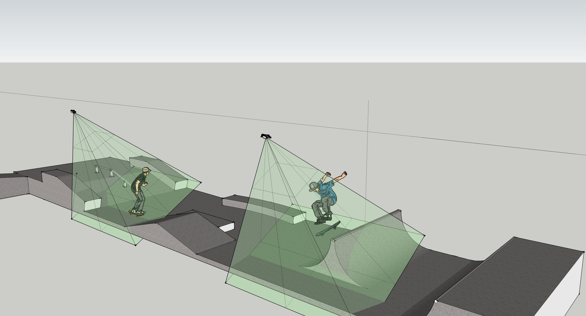
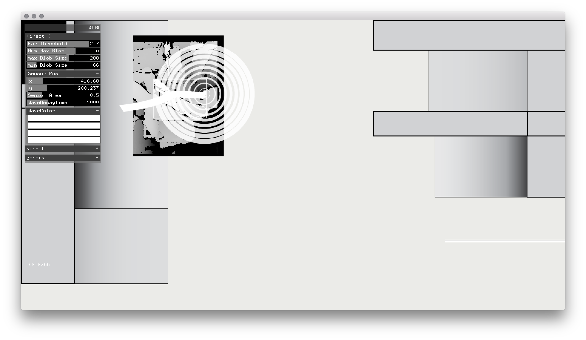

# Interactive Kinect Skate Park

In collaboration with [VJ Vigas](https://www.madmapper.com/artists/vigas/) doing the video mapping and the interactive sensor develop by [Edgar](https://www.github.com/aivuk) and [me](https://www.github.com/radames)

* Openframeworks
  * ofxBox2
  * ofxCv
  * ofxKinect
  * ofxSyphon
  * ofxOsc
  * ofxTwistedRibbon
  * ofxPostProcessing

Video [here](https://www.youtube.com/watch?v=mqQuPi-zMMI)

##Skate Park

##Project Plan

##Debug Screen

##Final

